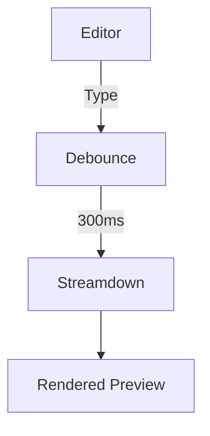

# Sample Markdown Document

This is a **test document** for the Aura Markdown preview feature.

## Features

### Code Highlighting

```python
def fibonacci(n):
    """Calculate the nth Fibonacci number."""
    if n <= 1:
        return n
    return fibonacci(n - 1) + fibonacci(n - 2)

# Example usage
print(fibonacci(10))  # Output: 55
```

### Math Support (KaTeX)

The quadratic formula is:

$$x = \frac{-b \pm \sqrt{b^2 - 4ac}}{2a}$$

Inline math works too: $E = mc^2$

### Tables

| Feature | Status | Notes |
|---------|--------|-------|
| Code highlighting | ✅ | Via Shiki |
| Math rendering | ✅ | Via KaTeX |
| Mermaid diagrams | ✅ | Interactive |
| Live preview | ✅ | 300ms debounce |

### Mermaid Diagrams



### Lists

- Item 1
- Item 2
  - Nested item 2.1
  - Nested item 2.2
- Item 3

1. First
2. Second
3. Third

### Blockquote

> "The only way to do great work is to love what you do."
> — Steve Jobs

### Links and Images

Check out [Streamdown](https://streamdown.ai/) for more info.

---

*This is italic text* and **this is bold**.
